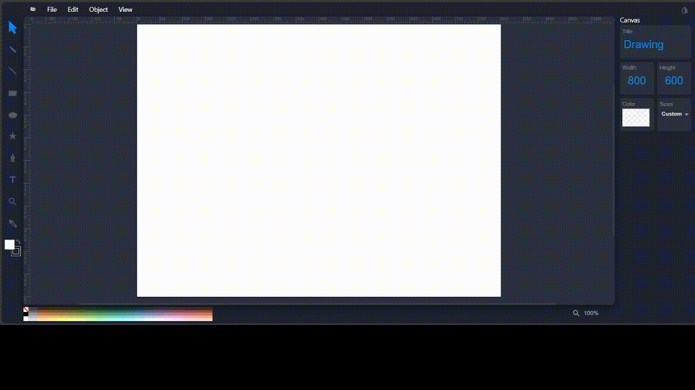
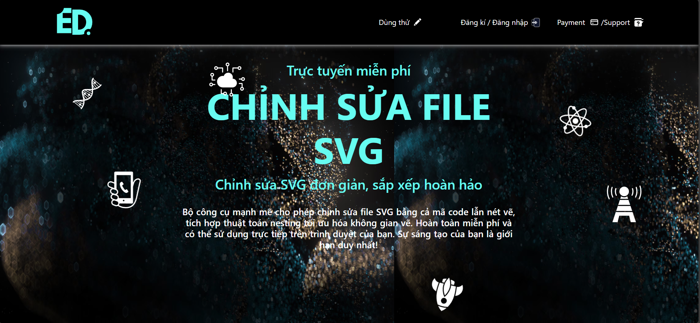
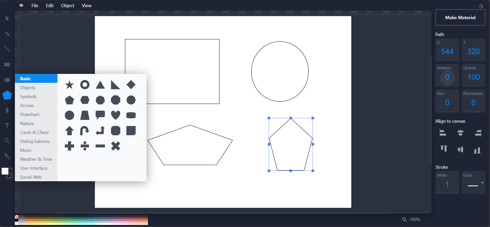
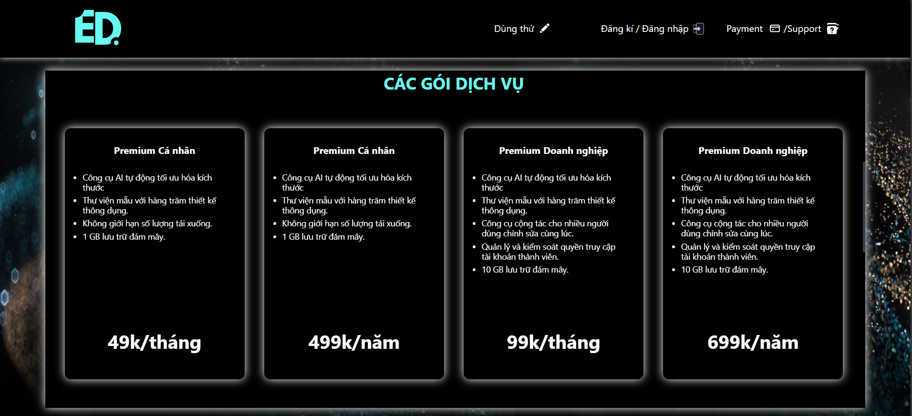
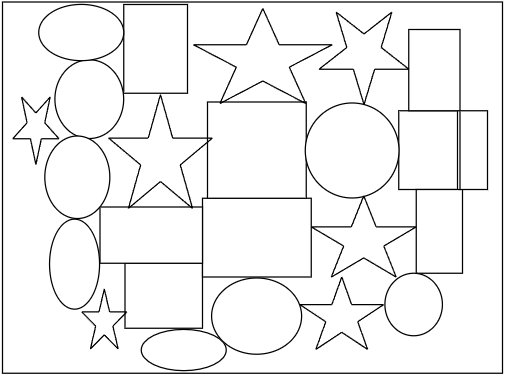

# EcoDesign Editor - Advanced SVG Editor with AI Nesting

<div align="center">


**🚀 See Nesting in Action:**



*AI-powered nesting automatically optimizes material usage*

[](http://ecologicaldesign.tech/)
[](https://www.docker.com/)
[](LICENSE)

</div>

## 🌟 Overview

**EcoDesign Editor** is a powerful web-based SVG editor that combines intuitive visual editing with advanced AI-powered nesting algorithms. Built for designers, makers, and manufacturers, it transforms the complex process of SVG editing and material optimization into a seamless, user-friendly experience.

**🚀 [Try Live Demo](http://ecologicaldesign.tech/)**

### Why EcoDesign Editor?

- **Visual SVG Editing**: Edit SVG files through an intuitive interface instead of complex code
- **AI-Powered Nesting**: Optimize material usage with advanced packing algorithms powered by **C++**
- **Web-Based**: No installation required - works directly in your browser
- **Professional Tools**: Complete toolkit for logo design, laser cutting preparation, and CNC optimization

## 📸 Screenshots

### Homepage

*Clean, professional interface with easy access to all features*

### Drawing Workspace

*Powerful SVG editing tools with real-time preview*

### Payment & Premium Features

*Flexible pricing plans to support the project*

## 📚 User Guide

### 🎨 **Basic SVG Operations**

#### **Import SVG Files**
1. Click **File** in the menu
2. Select **Open SVG**
3. Choose your SVG file to upload
4. Your design will appear in the workspace

#### **Export Your Work**
- **Save Image**: Export your drawing as an SVG file
  - Go to **File** → **Save Image**
- **Export PNG**: Convert your SVG to PNG format
  - Go to **File** → **Export PNG**
- **Save SVG Source**: Save to your account's database
  - Go to **File** → **Save SVG Source**
  - Your work is automatically stored and restored when you log in from any device

#### **View Source Code**
- **Keyboard shortcut**: Press `Ctrl+U`
- **Menu option**: Go to **View** → **Source...**
- This shows the actual SVG code you've created

### 🔧 **Advanced Nesting Guide**

**Nesting** is our signature feature that automatically optimizes how objects fit within materials, reducing waste and improving efficiency. **Powered by high-performance C++ algorithms** for lightning-fast optimization.

#### **Step-by-Step Nesting Process:**

1. **Create Material Boundary**:
   - Draw a rectangle representing your material sheet
   - Adjust dimensions to match your actual material size
   - Right-click and select **Make Material** to convert it from object to material boundary

2. **Add Objects to Nest**:
   - Draw any shapes you want to fit inside the material
   - These can be circles, rectangles, complex paths, or imported designs
   - Create as many objects as needed

3. **Execute Nesting**:
   - Select all objects you want to nest (hold Ctrl and click multiple objects)
   - Click the **Nesting Objects** button
   - Watch as the AI automatically arranges your objects for optimal space usage

4. **Review Results**:
   - Objects are automatically positioned to minimize waste
   - Material usage efficiency is calculated and displayed
   - Fine-tune positions if needed


*Example of C++-powered nesting optimization showing dramatic space efficiency improvement*

#### **Nesting Tips**:
- Use rectangular materials for best optimization results
- Ensure adequate spacing between objects for cutting tools
- Premium accounts get access to advanced nesting parameters

## ✨ Key Features

### 🎨 **Core SVG Editor**
- **Intuitive Interface**: Drag & drop editing like Photoshop/Illustrator
- **Complete Toolset**: Rectangles, circles, paths, text, gradients, and more
- **Layer Management**: Organize complex designs with multiple layers
- **Transform Tools**: Rotate, scale, align, and distribute objects
- **Undo/Redo**: Unlimited history for worry-free editing
- **Import/Export**: Support for SVG, PNG, PDF, and EPS formats

### 🔧 **AI Nesting Algorithm** - Unique Feature
- **Material Optimization**: Automatically arrange shapes to minimize waste
- **C++ Performance**: Lightning-fast calculations using optimized C++ algorithms
- **Laser Cutting Ready**: Perfect for CNC machines and laser cutters
- **Custom Spacing**: Adjustable padding between objects
- **Multi-Material Support**: Optimize across multiple sheets
- **Real-time Preview**: See optimization results instantly

### 💎 **Account & Premium System**

#### **Free Trial (7 Days)**
- ✅ Basic SVG editing tools
- ✅ Standard export formats (SVG, PNG)
- ✅ 50MB cloud storage
- ❌ Advanced drawing features limited
- ❌ No nesting optimization

#### **Premium Features**
- ✅ **Full Nesting Algorithm**: Complete C++-powered material optimization
- ✅ **Advanced Drawing Tools**: Professional-grade editing features
- ✅ **Premium Export**: PDF, EPS, high-resolution formats
- ✅ **Cloud Storage**: 1GB personal / 10GB business
- ✅ **Template Library**: Hundreds of professional designs
- ✅ **Priority Support**: Direct assistance via email

### 🚀 **Two Ways to Get Started**

1. **Create Account**: Get 7 days of premium features free
2. **Try Now**: Start editing immediately without registration

## 🛠️ Technology Stack

### **Backend Architecture**
```
├── app.py                    # Flask application server
├── src/
│   ├── db_manager/          # Database management layer
│   ├── nester.py           # AI nesting algorithm core
│   ├── object.py           # Object representation
│   ├── material.py         # Material management
│   └── SVG.py              # SVG processing engine
└── utils/                   # Helper utilities
    ├── transform.py        # Geometric transformations
    ├── polygon.py          # Polygon processing
    └── request.py          # Request handling
```

### **Frontend Architecture**
Based on the powerful [Method-Draw](https://github.com/methodofaction/Method-Draw) editor with significant enhancements:

```
app/static/js/
├── method-draw.js          # Main editor engine
├── svgcanvas.js           # Canvas management (8850+ lines)
├── nesting.js             # Nesting integration
├── premium.js             # Premium features
└── [30+ specialized modules]
```

### **High-Performance C++ Nesting Engine**
Our custom `aka_cad` library delivers industry-leading performance:


*Real nesting results showing C++ algorithm efficiency*

**Technical Implementation:**
- **C++ Core**: High-performance geometric algorithms written in optimized C++
- **Python Bindings**: Seamless integration via [pybind11](https://github.com/pybind/pybind11)
- **Advanced Algorithms**: Inspired by [libnest2d](https://github.com/tamasmeszaros/libnest2d)
- **Real-time Processing**: C++ enables instant optimization even for complex layouts
- **Memory Efficient**: Optimized data structures for handling large numbers of objects

## 🐳 Deployment

### **Docker-Only Deployment**
EcoDesign Editor is designed for simple Docker deployment:

```bash
# Clone the repository
git clone https://github.com/your-repo/ecodesign-editor.git
cd ecodesign-editor

# Build and run with Docker Compose
docker-compose up -d

# Access at http://localhost:5000
```

### **Environment Configuration**
```env
# MongoDB Connection
MONGODB_URI=mongodb://localhost:27017/ecodesign
MONGODB_DOCKER_URI=mongodb://mongo:27017/ecodesign

# Payment Integration (PayOS - Vietnam)
PAYOS_CLIENT_ID=your_client_id
PAYOS_API_KEY=your_api_key
PAYOS_CHECKSUM_KEY=your_checksum_key
```

## 🎯 Use Cases

### **Designers & Artists**
- Logo and icon design
- Illustration and vector art
- Print-ready graphics

### **Makers & Manufacturers**
- Laser cutting optimization
- CNC machining preparation
- Material waste reduction
- Production cost optimization

### **Educational**
- Design schools and courses
- Technical training programs
- Maker spaces and labs

## 🚀 Getting Started

1. **Visit [ecologicaldesign.tech](http://ecologicaldesign.tech/)**
2. **Choose your path**:
   - Click "Try Now" for immediate access
   - Create account for 7-day premium trial
3. **Start creating**:
   - Import existing SVG files
   - Create new designs from scratch
   - Use premium nesting for optimization
4. **Export and use**:
   - Download optimized layouts
   - Send directly to cutting machines

## 🏆 What Makes Us Different

### **Focus on Nesting Optimization**
Unlike traditional SVG editors, EcoDesign Editor specializes in **material optimization powered by C++**. Our nesting algorithm can reduce material waste by up to 40%, making it invaluable for:
- Manufacturing and production
- Maker projects and prototyping
- Cost-sensitive cutting operations

### **Web-Based Convenience**
- No software installation required
- Cross-platform compatibility
- Real-time collaboration features
- Cloud-based project storage

## 🙏 Acknowledgments

This project builds upon excellent open-source foundations:

- **[Method-Draw](https://github.com/methodofaction/Method-Draw)**: Core SVG editing engine
- **[pybind11](https://github.com/pybind/pybind11)**: Seamless C++/Python integration
- **[libnest2d](https://github.com/tamasmeszaros/libnest2d)**: Nesting algorithm inspiration

Special thanks to these projects and their contributors for making advanced SVG editing and optimization accessible to everyone.

## 📞 Contact & Support

- **Live Demo**: [ecologicaldesign.tech](http://ecologicaldesign.tech/)
- **Email**: [ngpthanh15@gmail.com](mailto:ngpthanh15@gmail.com)
- **Issues**: Use GitHub Issues for bug reports and feature requests

## 💰 Support the Project

EcoDesign Editor is developed with passion and dedication. Your support helps us:
- Maintain and improve the nesting algorithms
- Add new features and tools
- Keep the service running smoothly

**Try our 7-day premium trial** and see how advanced nesting can transform your workflow!

## 📄 License

This project is licensed under the MIT License - see the [LICENSE](LICENSE) file for details.

---

**EcoDesign Editor** - Where creativity meets optimization! 🎨✨

*Built with ❤️ for the maker community*
